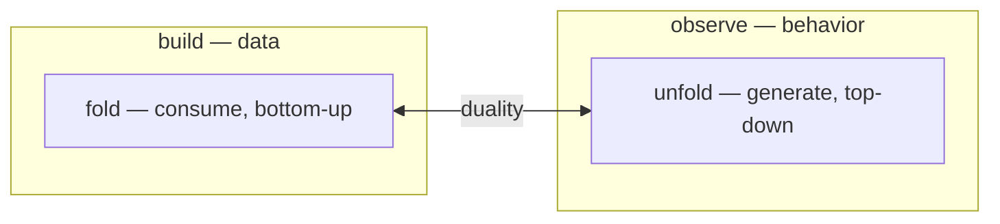

# Lapis — The Language, In One Document

> **Status:** Draft v0.1. This is the consolidated overview of Lapis's surface design: one document,
> sanity-checking the language end to end, and the seed for the marketing site. It is written
> example-first — every claim ends in a runnable block. The authoritative specifications remain
> [`theory/surface-syntax.md`](./theory/surface-syntax.md) (syntax) and
> [`theory/semantics.md`](./theory/semantics.md) (meaning); each section links to its backing spec
> rather than duplicating it. Formal vocabulary (initial algebra, coalgebra, and friends) lives in
> those specs; this page keeps to plain language.
>
> Sources consolidated here: `surface-syntax.md`, `syntax-design.md`, `semantics.md` §1,
> `users/rationale.md`, `users/why-lapis.md`, and the prototype's tests and examples
> ([lapis-js](https://github.com/lapis-lang/lapis-js)).

**Lapis is a programming language where you declare your data and its laws — and fold and unfold are
the only recursion you'll write.**

---

## 1. Why Lapis?

You declare algebraic laws — `associative`, `distributive` — and the compiler verifies them with
generated counterexamples, then _exploits_ them: fusing traversals, short-circuiting folds,
calculating the one-pass program from your two-pass specification. Horner's rule, applied by your
compiler, because it trusts your laws. That trust is earned structurally: the language has no
general recursion, so every program terminates by construction and every operation has a known
algebraic shape.

The full hook, with the Horner example worked end to end, is
[`users/why-lapis.md`](./users/why-lapis.md).

---

## 2. Starting Small: Declaring Data

### 2.1 An enumeration

Every Lapis program starts by declaring data. The smallest declaration is an enumeration — variants,
no fields:

```lapis
data Color
    Red
    Green
    Blue
```

The variants are values — singletons, ready to use:

```lapis
Color Red    /* the Red singleton */
```

That block is a **comment** — Lapis spells them `/* ... */`, with nesting: a comment spans lines or
trails an expression. The trailing example below records what an expression produces; a comment on
its own line describes the construct beneath it. The position is the meaning (details in
[spec §1.4](./theory/surface-syntax.md#14-comments)).

If you've written a Java `enum` or a Python `Enum`, this reads the same way. The difference is
what's underneath: there is no separate `enum` mechanism. This is the same `data` declaration every
other type uses, with the fields simply left out.

One more kind of member: a variant can be a **pattern** — a shape of text, every match of which is a
value of the type. Extending the declaration:

```lapis
data Color
    Red
    Green
    Blue
    #[0-9A-F]{6}
```

`Red` is constructed by name; the pattern needs no name — its spelling is its constructor:

```lapis
#1A2B3C             /* a Color — six hex digits after a '#' */
```

That is: when you write `#1A2B3C`, it's `Color`'s pattern that matched it. Your declaration added a
literal to the language.

### 2.2 Fields

Variants carry fields by naming them:

```lapis
data Point
    Point2D x: Number y: Number
    Point3D x: Number y: Number z: Number
```

Construction is prefix — the variant name, then the fields:

```lapis
Point2D x: 1 y: 2                  /* a Point2D */
Point3D x: 1 y: 2 z: 3             /* a Point3D */
```

Reading is symmetric — a field is read directly:

```lapis
somePoint x                        /* 1 */
somePoint y                        /* 2 */
```

Pattern constructors carry fields too — a **capture** (`<name: Type>`) names the slice of the match
that becomes a field:

```lapis
data Rational
    Ratio <p: Int>/<q: Int>

data Complex
    Cartesian <re: Float>+<im: Float>i
```

Whether a value came from a named variant or a pattern match, a field is a field — same reads, same
places.

No `new`, no constructor-overload gymnastics.

### 2.3 The built-ins are data too

Where did `Nat` come from, and why does `42` spell a number? §2.1 showed the trick without naming
it: the "built-in" types are ordinary `data` declarations whose constructors are **patterns**:

| Type     | Pattern(s)              | Example   |
| -------- | ----------------------- | --------- |
| `Char`   | `.`                     | `'a'`     |
| `String` | `"<Char>*"`             | `"hello"` |
| `Nat`    | `[0-9]+`                | `42`      |
| `Float`  | `-?[0-9]*\.[0-9]+`      | `3.14`    |
| `Symbol` | `#[a-zA-Z][a-zA-Z0-9]*` | `#sum`    |

When you write `42`, it's `Nat`'s pattern `[0-9]+` that matched it — the same move as `Color`'s
`#[0-9A-F]{6}`, just declared for you. The literal shapes a program recognizes are chosen by the
program, not the language. And the value spellings — `'a'` one character, `"hello"` a string — are
the same spellings every user declaration's literals take (§1.4's reservation rules keep the forms
disjoint from comments and from declared patterns).

### 2.4 Recursion

A field's type is any type in scope — including the one being declared. Two spellings for the
self-reference, same meaning:

```lapis
data NatList
    Nil
    Cons head: Nat rest: NatList    /* by name — if NatList is in scope */
```

And a field can reference "the rest of the type being declared" positionally with `Family`:

```lapis
data NatList
    Nil
    Cons head: Nat rest: Family      /* same meaning, no name needed */
```

`Family` is the spelling that works _before_ the type's own name could resolve — mutually recursive
declarations, or just not wanting to repeat the name. It also makes the recursion **open**: a
`Family`-typed field means "any future subtype's rest", so subtypes can extend the list with richer
variants. The by-name spelling closes it — `rest: NatList` means exactly `NatList`, no more, no less
(closed recursion — the whole value is always one fixed type). (What a subtype is, and how a data
type gains one, is §2.5.)

`Nil` is the empty list; `Cons` carries a head and the rest. Values are built by chaining:

```lapis
NatList Cons head: 1 rest: (NatList Cons head: 2 rest: NatList Nil)
```

That's an algebraic data type — the thing behind sealed-interface hierarchies and dataclass unions —
— in seven lines, with recursion spelled either `rest: NatList` or `rest: Family`.
([spec §4.1](./theory/surface-syntax.md#4-declaration-formats))

### 2.5 Subtyping: extending a declared data

§2.4 let slip the word _subtype_ — here is what it meant. A data type can be declared as an
**extension** of another, with `<:` ("is a"):

```lapis
data Point2
    Cartesian2 x: Number y: Number
    Polar2     r: Number theta: Number

data Point3 <: Point2
    Cartesian3 x: Number y: Number z: Number
    Polar3     r: Number theta: Number phi: Number
```

`Point3` is a new type whose variants are **the parent's variants plus its own**. The parent's
constructors work on the child — inherited variants construct through the child and belong to both
types:

```lapis
Point2 Cartesian2 x: 1 y: 2       /* a Point2 — as before */
Point3 Cartesian2 x: 1 y: 2       /* the same variant, built through the child — a Point3 AND a Point2 */
Point3 Cartesian3 x: 1 y: 2 z: 3  /* a new variant — and also a Point2 */
```

And the membership direction is asymmetric: every `Point3` is a `Point2` — wherever a `Point2` is
expected, any `Point3` may appear — but a plain `Point2` value is _not_ a `Point3`. Subtypes add;
they never widen.

Note what the subtyping is between: **types, not variants**. `Cartesian3` is a new variant of
`Point3` — it is not a subtype of `Cartesian2`, and no variant-to-variant subtype relation exists.
The two Cartesian variants simply share fields, the way siblings share a surname; what makes
`Point3 Cartesian3 x: 1 y: 2 z: 3` acceptable where a `Point2` is expected is `Point3 <: Point2`,
the whole declaration. (The reference model agrees: its `Point2D`/`Point3D` variants have no subtype
link between them either — new fields live in new variants.)

This is **comb inheritance** (NewtonScript-style): the child's variant set combines with the
parent's, down the whole chain. The name comes from the shape the two lookup paths make in the
reference model — a prototype chain (shared behavior, the comb's spine) plus a _parent_ chain
(instance-level delegation, the comb's teeth); in Lapis the teeth are the delegation links between a
child type's variants and their same-name parents down the chain. When anything is looked up on a
`Point3` value — a variant's fields, later an operation — the lookup first checks what `Point3`
declares, then delegates to `Point2` and repeats. Two consequences matter in practice:

**Variant narrowing.** A child may re-declare an inherited variant to sharpen what its fields _hold_
— provided every re-specified field type is a **subtype** of the parent's (covariant), and no new
fields appear:

```lapis
data NatList <: IntList
    Cons head: Nat rest: Family
```

`NatList` re-declares `Cons` with `head: Nat` — a narrowing of `IntList`'s `head: Int` (every `Nat`
is an `Int`, so the substitution holds). Unmentioned fields — `rest` here — are inherited unchanged;
introducing a field the parent doesn't have is rejected.

And here §2.4's promise lands: `rest: Family` is what makes these extensions possible at all. A
`Family`-typed field means "any future subtype's rest" — that's **open recursion**. The by-name
spelling (`rest: IntList`) closes it — exactly `IntList`, no subtype welcome. Same text, two
recursion disciplines, chosen per field:

| Spelling        | Recursion | Subtypes                           |
| --------------- | --------- | ---------------------------------- |
| `rest: Family`  | open      | welcome — richer variants extend   |
| `rest: IntList` | closed    | none — the value is one fixed type |

`<:` is the whole subtyping story for data: more variants, narrower fields. No interfaces, no
abstract classes, no cast operators — a declaration that names a parent, and the chain does the
rest. ([spec §4.1](./theory/surface-syntax.md#4-declaration-formats))

Everything a `Point2` can be asked, a `Point3` can answer — that's the promise `<:` makes, and §3
shows how the language keeps it.

### 2.6 The lattice's bounds: `Any` and `Nothing`

Every type so far has been a `data` you declared. Two more are always in scope — the bounds of the
whole type universe:

- **`Any`** — the top. Every value is an `Any`, with no declaration needed. A field typed `Any`
  accepts anything:

  ```lapis
  data Box
      Wrap value: Any     /* accepts strings, numbers, any declared type's values */
  ```

- **`Nothing`** — the bottom. It has **no values** — no constructor can produce one, no pattern can
  match one. Its use is at elimination: a fold whose `out` is `Nothing` can never return, so
  declaring one is a compile-time-checked way of saying "this case is impossible". And the compiler
  trusts it: code after a `Nothing` result is unreachable by construction.

The pair does for the whole language what it does in any lattice: `Nothing <: X <: Any` for every
type `X` — implicitly, with no `[<: Any]` ceremony (every type is already a subtype; writing it
would be redundant and is rejected). Subtyping's rules from §2.5 stay put: extension adds variants,
narrowing sharpens fields — the bounds just anchor the ends.

### 2.7 Many types at once

Real domains have several types that reference each other. Two moves cover it:

**Mutual recursion.** Two types can reference each other — the compiler resolves the whole
declaration set together, so declaration order doesn't matter:

```lapis
data Expr
    Lit value: Nat
    Block stmt: Stmt body: Family      /* references Stmt — not yet declared */

data Stmt
    Assign name: Symbol value: Nat
    Seq first: Family second: Family   /* Family = this type's rest — no name needed */
```

**Sorts.** A field's type can be _another_ declared type, and construction enforces it — values of
the wrong sort are rejected at construction:

```lapis
Point2D x: 1 y: 2                 /* a Point — fine */
Expr Lit value: Point2D x: 1 y: 2 /* rejected — a Point is not a Nat */
```

That's the whole mechanism: each type is its own declaration, cross-references are ordinary field
types, and construction-time checks keep the sorts straight. No shared namespace, no coordination
between declarations — the same `data` form throughout.
([spec §4.1](./theory/surface-syntax.md#4-declaration-formats))

---

## 3. Doing Things With Data

### 3.1 Fold: reading a data value

Operations are declared **inside** the data declaration. A `fold` has one case arm per variant, and
each arm replaces the constructor with an operation:

```lapis
data NatList
    Nil
    Cons head: Nat rest: Family

    fold sum <out: Nat>
        Nil -> 0
        Cons head rest -> head + rest
```

Using it is the same shape — name the operation, pass the value:

```lapis
xs sum              /* 3 */
```

This is the _only_ way to consume a `NatList` — and that's the point. Every consumer of a data type
has the same shape, so the compiler knows the shape of every operation you write.
([spec §5.1](./theory/surface-syntax.md#5-foldunfoldmapmerge-declarations))

**One shape, several options.** The plain fold above is the base member of a small family — every
option changes exactly one thing about the traversal, and the whole family stays bottom-up and
total:

| Option         | What it adds                                                       | Classic name  |
| -------------- | ------------------------------------------------------------------ | ------------- |
| plain fold     | one arm per variant; recursive fields arrive **already folded**    | catamorphism  |
| parameterized  | `<in: …>` — one input threaded through the whole traversal         | —             |
| `old`          | the arm also sees the original sub-value, **before** folding       | paramorphism  |
| `prev`         | look **deeper** than the immediate sub-result                      | histomorphism |
| `aux`          | a companion fold's results ride the same traversal                 | zygomorphism  |
| `scan`         | the fold's result at _every_ subterm, root-first                   | scan lemma    |
| `_` (wildcard) | one arm that catches whatever the others don't — open variant sets | —             |

A **parameterized fold** carries one input — here, an element to append. Recursive positions arrive
as partially-applied continuations: give the input and the traversal continues:

```lapis
fold append <in: v Nat, out: Family>
    Nil -> NatList Cons head: v rest: NatList Nil
    Cons head rest -> NatList Cons head: head rest: (rest append: v)

xs append: 3      /* with input — called as a method; without input, read as a property */
```

An **auxiliary fold** fuses a companion computation into the traversal — checking balance needs each
node's depth, but that's a second pass unless `aux` rides along:

```lapis
fold depth <out: Nat>
    Leaf -> 0
    Node left right -> 1 + max left right

fold balanced <aux: #depth, out: Bool>
    Leaf -> true
    Node left right -> (left and right) and (1 = abs (depth left - depth right))
```

`old` shows up with contracts in §6.2; `prev` is how `fib` reaches two levels back — the result one
level below the immediate child; `scan` turns one fold into _all_ the partial results
(`[6, 5, 3,
0]` for `[1, 2, 3]` under `sum`). And the wildcard `_` arm keeps the fold total over
open variant sets — the piece that lets §2.5's subtypes extend a parent's operation with arms for
only their new variants: inherited variants keep the parent's arms, new variants supply theirs, and
the fold stays exhaustive over the combined member set. That is how the language keeps §2.5's
promise — everything a `Point2` can be asked, a `Point3` can answer.

### 3.2 Unfold: generating data

The dual. Where `fold` consumes a finished value, `unfold` builds one up from a seed — declared with
a `behavior`, the type you observe rather than construct:

```lapis
behavior Stream
    head: <out: Number>
    tail: <out: Self>

    unfold From <in: n Number>
        head -> n
        next -> n + 1

Stream From: 0
        /* observe: head 0, tail head 1 */
```

Same declaration shape as `data`, arrows reversed. A stream is observed one step at a time and never
stored — potentially endless, always productive.

Observers can take input too, and one behavior can offer several generators:

```lapis
behavior Stream
    head: <out: Number>
    tail: <out: Self>
    nth:  <in: i Number, out: Number>       /* the i-th observation */

    unfold From <in: n Number>
        head -> n
        next -> n + 1
        nth  -> (n + i)

    unfold Fibonacci <in: pair (a: Number, b: Number)>
        head -> pair a
        next -> (a: pair b, b: (pair a + pair b))

Stream Fibonacci pair: (a: 0, b: 1)      /* 0, 1, 1, 2, 3, 5, ... */
```

Lazy by construction: each observation is computed on demand — `head` when you read it, the next
instance when you step to it (and it's the _same_ instance each time — a continuation is memoized).
Nothing is computed until observed, so an infinite tree is as cheap to name as a finite one: the two
children of an infinite tree are two more unfolds. Potentially endless, always productive.
([spec §4.2, §5.2](./theory/surface-syntax.md#4-declaration-formats))

### 3.3 Merge — one pass instead of two

Unfold builds the structure; fold tears it down. `merge` fuses them into **one traversal** — the
intermediate structure is never built:

```lapis
data NatList
    Nil
    Cons head: Nat rest: Family

    fold sum <out: Nat>
        Nil -> 0
        Cons head rest -> head + rest

    unfold From <in: n Nat>
        Nil -> n = 0
        Cons -> n > 0 | (head: n, rest: (n - 1))

    merge Total <#From, #sum>

NatList Total: 5    /* 15 — one pass, no list materialized */
```

You wrote the two-pass specification (generate a list of descending numbers, then sum it). The
language calculated the one-pass program. Factorial is the classic: generate-and-count fused is
factorial, with no list ever allocated.
([spec §5.4](./theory/surface-syntax.md#54-merge-declaration))

### 3.4 Map

Map transforms each field position; all other structure is preserved by construction:

```lapis
map scaleEach <in: x Number, out: Family> [v rest | Family Cons head: v * x rest: (rest x)]
```

A map can also be declared as the **inverse** of another — one side states the relationship, the
other is derived, and the compiler enforces the pair is one-to-one:

```lapis
map toCelsius    <out: Family> [v rest | Family Cons head: (v - 32) * 5 / 9 rest: rest]
map toFahrenheit <out: Family, inverse: #toCelsius> [v rest | Family Cons head: v * 9 / 5 + 32 rest: rest]

readings toFahrenheit toCelsius      /* back where you started — round-trip is identity */
```

([spec §5.3](./theory/surface-syntax.md#53-map-declaration))

### 3.5 Scan: all the partial results at once

Sometimes one final answer isn't enough — you want the fold's answer at every stopping point. A
`scan` applies an existing fold to the whole value _and_ to every subterm, all in one pass:

```lapis
scan cumulative <#sum>

xs sum                 /* 6 */
xs cumulative          /* [6, 5, 3, 0] — the total, then each tail's sum */
```

The last element is always the fold of the empty base (`0` here); the first is the whole structure's
fold. It works on trees too — every subtree's sum, root first. This is the datatype-generic version
of what Haskell calls `scanr`, and it falls out of the fold discipline for free: the traversal was
already there; scan just keeps the intermediate results instead of discarding them.

**Aliases.** Any operation can carry extra names — same operation, spelled differently where the
domain says so:

```lapis
fold meet <in: other Self, out: Self>
    ... aliases (and)
```

`xs meet ys` and `xs and ys` are the same operation. Aliases keep the algebraic name (`meet`,
`join`) and the programmer's shorthand (`and`, `or`) from fighting over spelling.

---

## 4. The Idea Underneath: Duality

Read §2–§3 again and you'll see it: every concept came in a pair, the second member the first seen
in reverse. Build ↔ observe. Consume ↔ generate. That's **duality** — and its payoff is practical:
learn one side and you already know the other, and a fact about one side is a fact about the other
for free. Lapis doesn't just borrow the idea — it makes it the syntax. The keywords themselves come
in dual pairs.

### 4.1 Fold is universal

`fold` being the only way to consume data isn't a limitation — it's a theorem. Every total function
on a data type that respects its structure _is_ a fold: `sum`, `length`, `map`, `filter`, `reverse`
are all the same shape with different constructors replaced.

> _Formally:_ a data type is the initial algebra of its shape functor, and fold is the unique
> homomorphism out of it ([`theory/semantics.md`](./theory/semantics.md)).

### 4.2 Unfold is its dual

Where fold is the universal _consumer_, unfold is the universal _producer_: from a seed, a step
function either stops or produces a value and a new seed. Fold consumes finite structure bottom-up;
unfold generates potentially infinite structure top-down. Together they are the two fundamental
activities — **consuming** and **generating**.

### 4.3 The duality of semantics

The pair does real work at the level of the language itself: **what a program _means_ is a fold over
its syntax; how it _runs_ is an unfold from its state.** For most languages that's a description in
a graduate textbook. Lapis takes it as a syntax decision:

> _Formally:_ denotational semantics is structured by fold, operational semantics by unfold — see
> [`theory/semantics.md`](./theory/semantics.md) §1.

| Build                                     | Observe                                                  |
| ----------------------------------------- | -------------------------------------------------------- |
| `data` — declare how things are built     | `behavior` — declare how things are observed             |
| `fold` — consume, finite, always finishes | `unfold` — generate, possibly endless, always productive |
| `relation` — compute everything reachable | `query` — explore outward from a seed                    |
| `Family` — "the rest of this data"        | `Self` — "the rest of this behavior"                     |
| reason from how things are built          | reason from what you can observe                         |



### 4.4 Four payoffs, one idea

The duality earns its keep four ways, each landing on a concrete Lapis feature:

| Payoff             | In Lapis                                                                                                                       |
| ------------------ | ------------------------------------------------------------------------------------------------------------------------------ |
| **Transfer**       | Declare a law once; it holds however the structure is traversed.                                                               |
| **Simplification** | `merge` — fusion by construction, the intermediate structure never exists.                                                     |
| **Certification**  | Every program finishes — totality by construction; laws are checked before the program runs, with a counterexample on failure. |
| **Discovery**      | `query` is just `relation` seen from the other side.                                                                           |

---

## 5. The Other Declaration Pairs

### 5.1 Relation ↔ Query

A `relation` is a data type with two distinguished folds — `origin` and `destination` — that project
each variant to its endpoints. Its dual, `query`, is a behavior type whose observers split into
three roles: what to output, when you're done, and whether the result is accepted. Where
`relation`'s closure computes everything reachable, `query`'s `explore` walks outward from a seed.

```lapis
relation Ancestor
    Direct from: String to: String
    Transitive hop: Family rest: Family

    fold origin <out: String>
        Direct from _ -> from
        Transitive hop _ -> hop

    fold destination <out: String>
        Direct _ to -> to
        Transitive _ rest -> rest
```

```lapis
Ancestor closure: base                       /* everything reachable from the base facts */
Ancestor reachableFrom: closed from: "alice"
```

That's Datalog's reachability, as an ordinary declaration. And `query` is the same idea reversed:
closing over facts computes everything reachable; exploring from a seed walks the paths themselves.
([spec §4.4–4.5](./theory/surface-syntax.md#4-declaration-formats))

Two things come free with the pair, because they're derived from the declarations:

- **The join invariant is auto-generated.** For recursive variants with two endpoint-typed fields,
  the compiler derives `first destination = second origin` — composition — and enforces it at
  construction. You never write it; you couldn't get it wrong if you tried.
- **Cycles are handled.** The closure deduplicates by endpoint pair (Datalog's flat-tuple
  semantics), so cyclic graphs terminate — the derivation may be infinite, the reachable set isn't.

And each operation means something specific on proofs: a relation instance _is_ a proof witness —
`Direct` is an axiom, `Transitive` is a derivation step — so `fold` reads a proof, `unfold` writes
one, `map` re-labels it, `merge` fuses reading and writing. When to use which side: enumerate
_everything_ reachable, use `relation` (bottom-up, complete); answer one query lazily or control the
search, use `query` (top-down, stops when it has enough).

### 5.2 IO — a state machine

Side effects are declared the way you'd draw one: state fields, plus steps that return the next
state and an output — in the same declaration language as everything else:

```lapis
io Prompt
    count: Number
    Tick n -> (state: (n + 1), output: n)
```

([spec §4.6](./theory/surface-syntax.md#4-declaration-formats))

### 5.3 Modules — dependencies as values

Types compose into programs through modules — and a module is a _value_: a function from its
dependencies to its exports. Nothing is resolved through global imports; dependencies arrive
explicitly at instantiation:

```lapis
module Lists (T: Type)
    List:  data Nil / Cons head: T rest: Family
    NumList: data Nil / Cons head: Nat rest: Family

Lists Num:    /* an instance — its own fresh types */
Lists Symbol: /* another instance — independent */
```

A module can **extend** another: the child's exports layer on top of the parent's (child keys
override parent keys), and the chain resolves root-first:

```lapis
module Collections extends Lists
    Stack: data Empty / Push value: T rest: Family
```

Contracts work on modules like everything else — `demands` on dependencies, `ensures` on exports,
checked at instantiation. And a program is one module wiring others together: `system` composes
module instances and hands the result to the runtime — the IO machine of §5.2 runs it.

---

## 6. Systematic Consequences

These aren't bolted-on features — they fall out of the fold/unfold discipline.

### 6.1 Laws: declared, verified, exploited

Properties live in the fold's spec record. The compiler verifies them against generated samples
(`LawError` with a counterexample, before the program runs) and exploits them two ways: at `merge`
time (fusion) and at **call time** (short-circuit guards):

```lapis
data Num
    N value: Number

    fold add <in: other Self, out: Self, properties: (commutative, associative, identity: (Num N: 0))>
        N value -> Num N: value + other value

    fold multiply <in: other Self, out: Self, properties: (distributiveOver: #add)>
        N value -> Num N: value * other value
```

Declare `distributive`, and fusion — Horner's rule — is the compiler's job, not yours. Declare
`identity`, and `x add (Num N: 0)` never even enters the fold — the guard returns `x` itself, by
reference, after a single equality check. `absorbing` and `idempotent` get the same treatment: the
laws aren't just checked, they're _used_. ([details](./users/why-lapis.md),
[law testing](./theory/law-testing.md))

### 6.2 Contracts: demands, ensures, invariant, rescue

Contract clauses are keyword parts of the fold spec — preconditions checked before the fold runs,
postconditions with `old` snapshots, structured recovery:

```lapis
fold pop <out: Array>
    demands: [self | self size > 0]
    ensures: [self old result | result size = old size - 1]
    Empty -> Error signal: "Cannot pop empty stack"
    Push value rest -> value , old rest
```

([spec §5.1](./theory/surface-syntax.md#5-foldunfoldmapmerge-declarations))

### 6.3 Protocols: operations a type must provide

A `protocol` declares folds that conforming types must provide; `satisfies:` asserts conformance,
verified structurally. Abstract methods may carry default bodies:

```lapis
protocol Ordered
    fold compare <in: other Self, out: Number>

data Num
    N value: Number

    satisfies: Ordered
    fold compare <in: other Self, out: Number>
        N value -> value - other value
```

([spec §4.3](./theory/surface-syntax.md#43-protocol---qualified-type))

### 6.4 Invariants on variants

Contracts live on folds (§6.2) — and on variants, where they constrain _relationships between
fields_, beyond what individual field types can say:

```lapis
data Range
    CharRange invariant: (start <= end)
        start: Char
        end: Char
```

Checked at construction — `CharRange start: 'z' end: 'a'` is rejected before any fold sees it.

---

## 7. The Syntax Itself

### 7.1 Your declarations are your lexer

§2.3 showed the trick without naming it: the "built-in" types are ordinary `data` declarations, and
their pattern constructors are **lexical rules** — the lexer is driven by the `data` declarations in
scope, so the set of literal shapes in a program is chosen by the program.

The pattern language is a flat regular fragment (no alternation, no groups — decompose with variants
instead), compiled to a fast table-driven matcher, capped at 80 source characters and 80 consumed
characters — hygiene bounds, stated loudly at the edges.
([spec §1.3](./theory/surface-syntax.md#13-pattern-matched-data-types))

### 7.2 Three precedence levels — no ladder

Three levels, strictly ordered (unary > binary > keyword); **no precedence ladder within binary
operators**. All binary operators name folds, evaluated left-to-right:

```lapis
1 + 2 * 3           /* 9 — parses as (1 + 2) * 3 */
1 + (2 * 3)         /* 7 — explicit parentheses for mathematical grouping */
nats take: 5        /* keyword form: multi-argument */
Color Red toHex     /* unary chains: left to right */
```

No table of seventeen precedence levels to memorize. If grouping matters, say so.
([spec §2](./theory/surface-syntax.md#2-expression-precedence))

**Reads follow the uniform access principle.** An operation without input is read as a property;
with input, it's called:

```lapis
Color Red toHex       /* property — parameterless fold */
xs append: 3          /* method — the fold carries an input */
```

No `()` vs property distinction to remember per operation: the declaration's shape decides, and it
reads the same everywhere.

### 7.3 Layout

Significant indentation, fixed 4-space unit, declaration bodies and case tables shaped by columns.
Newlines separate body lines; case arms may be inline or indented:

```lapis
data Color
    Red
    Green
    Blue
    #[0-9A-F]{6}
```

Comments follow the same layout logic: a comment on its own line describes the construct beneath it
(forward association); a comment trailing an expression records that expression's result. Blank
lines separate the groups — a reader-facing style rule, never a grammar rule: reformatting blank
lines can never change which construct a comment describes.
([spec §6](./theory/surface-syntax.md#6-indentation-strategy))

### 7.4 Naming conventions — the position tells you the case

Names carry their role in their case, checked at declaration:

| Role                          | Convention         | Example           |
| ----------------------------- | ------------------ | ----------------- |
| Type, variant, unfold         | PascalCase         | `NatList`, `Cons` |
| Field, fold, map, alias       | camelCase          | `head`, `sum`     |
| Keyword-part references (`#`) | the name it quotes | `#sum`            |

No `I`-prefixes, no `_` prefixes, no Hungarian — the case _is_ the convention, and the compiler
enforces it. (`scan` names follow folds; `merge` names follow their composition — PascalCase when
the pipeline starts with an unfold, camelCase otherwise.)

---

## 8. The Whole Thing At Once

```lapis
data Stack
    Empty
    Push value: Any rest: Family

    fold size <out: Number>
        Empty -> 0
        Push _ rest -> 1 + rest

    fold peek
        Empty -> nil
        Push value -> value

    fold pop <para>
        Empty -> nil
        Push value rest -> value , old rest

    unfold FromArray <in: arr Array>
        Empty -> arr isEmpty
        Push -> arr notEmpty | (value: arr first, rest: arr tail)

Stack Push value: 3 rest: (Stack Push value: 2 rest: Stack Empty)
        /* then: size 2, peek 3, pop [3, Push(value: 2, rest: Empty)] */
```

Note `pop`'s `<para>`: it makes `old` available — the original sub-value _before_ folding, for
handlers that need both the transformed and the untouched piece. `prev` and `aux` similarly expose
two other common shapes (previous results, auxiliary results) as keywords, not libraries.
([spec §7](./theory/surface-syntax.md#7-special-references-in-expressions))

---

## 9. The Language in 19 Keywords

| Keyword     | Purpose                                             |
| ----------- | --------------------------------------------------- |
| `data`      | Declare a type by how its values are built          |
| `<:`        | Declare a type as an extension of another (§2.5)    |
| `behavior`  | Declare a type by how its values are observed       |
| `protocol`  | Declare operations a type must provide              |
| `relation`  | Declare linked data with two endpoints              |
| `query`     | Declare a search over generated states              |
| `io`        | Declare a state machine for side effects            |
| `fold`      | Consume a data value                                |
| `unfold`    | Generate values from a seed                         |
| `map`       | Transform fields, structure preserved               |
| `merge`     | Fuse generate + consume into one pass               |
| `satisfies` | Assert a type meets a protocol                      |
| `not`       | Boolean negation (prefix)                           |
| `self`      | The current instance (always in scope)              |
| `Family`    | "The rest of this data" — recursion in data         |
| `Self`      | "The rest of this behavior" — recursion in behavior |
| `old`       | The original sub-value, before folding              |
| `prev`      | The previous fold's result                          |
| `aux`       | An auxiliary fold's result                          |

Plus `nil`, `true`, `false`. That is the entire reserved-word list.

---

## 10. What We Left Out, On Purpose

- **No base types.** `Nat`, `Int`, `String`, `Bool` are ordinary `data` types you could have
  declared yourself. Uniformity is what makes laws checkable over _all_ types.
- **No general recursion.** No `fix`, no `while`, no self-call. Totality by construction — no
  termination checker, no fuel monad.
- **No operator precedence ladder.** Uniform binary precedence; parentheses when grouping matters.
- **No alternation inside patterns.** Multiple variants are the decomposition tool — and keep
  patterns compilable to fast table-driven matchers.
- **No `let`-generalization, no polymorphic recursion.** The grammar-native typing is what lets the
  compiler trust the fold shape it is given.

Each restriction _enables_ the payoffs in §4.4. The restriction is the feature.

---

## 11. Where to Read More

| Want…                                      | Read                                                     |
| ------------------------------------------ | -------------------------------------------------------- |
| The hook, in five minutes                  | [`users/why-lapis.md`](./users/why-lapis.md)             |
| The full narrative journey                 | [`users/rationale.md`](./users/rationale.md)             |
| The complete syntax specification          | [`theory/surface-syntax.md`](./theory/surface-syntax.md) |
| The formal semantics (the duality at work) | [`theory/semantics.md`](./theory/semantics.md)           |
| The living prototype                       | [lapis-js](https://github.com/lapis-lang/lapis-js)       |

---

## 12. Sanity-Check Findings (frictions found while drafting)

This document doubles as the transliteration exercise: every example above was rewritten from the
prototype's tests/examples or the spec. Places where the transliteration felt underdetermined — each
is a real finding for the spec:

1. **Unfold use-site syntax is not pinned.** §8 of `surface-syntax.md` shows `unfold FromArray`
   declared but never called. This draft assumes constructor-position application
   (`NatList From: 5`, `Stream From: 0`), mirroring named-variant application. The spec should state
   it.
2. **Generator-arm alternation `cond | value` is underdocumented.** The `FromArray` arms use
   `Push -> arr notEmpty | (value: ..., rest: ...)`; the reading (condition-fallback producing
   variant-or-nil) is inferred from the prototype's `n <= 0 ? {} : null` shape. Worth one paragraph
   in §5.2.
3. **`map`'s relation to law-carrying folds is unsettled.** §5.3 specifies `map` as a single-line
   block transform; but `users/why-lapis.md`'s Horner example models `scaleEach` as a _fold_ with
   per-variant arms carrying `properties: (distributive: sum)`. Which is canonical for "transform
   each element" — and can a `map` carry laws? The overview uses the §5.3 form; the spec should
   reconcile.
4. **User-defined pattern types lack a declaration form.** §1.3 says user types declare their own
   patterns (prose: `NatPat = [0-9]+`), but no `data`-level syntax is pinned for it. This overview
   now _teaches_ a concrete form (§2.1): a `data` declaration mixing named variants and pattern
   members (`data Color: Red Green Blue #[0-9A-F]{6}`), which is exactly the mixed-carrier surface
   spelling in PBI #80's scope (tentative there, incl. the lexing syntax). The spec must pin it —
   this document's first example now depends on it.
5. **`io` steps have no dual shown.** §4.6 gives the state-machine form; the overview's IO section
   is the first user-facing example. Whether `io` deserves a paired construct (its observe-side
   dual) is an open design question.
6. **Top-level value definitions are unpinned — and this document initially invented them.** The
   grammar has no `name = expr` binding form; yet `surface-syntax.md` §8's own complete example
   writes `s = Stack Push ...`, and this overview did the same on first draft. `=` is an equality
   _operator_ (fold name) in predicates — not a definition keyword. The spec needs a decision: how
   are named values introduced at top level (bare expressions only? a definition form?), and the
   examples everywhere should stop leaning on `=`.

7. **Variant qualification at construction — reframed while drafting: qualification is
   disambiguation, for both constructor kinds.** The first draft flagged the asymmetry
   (`Point Point2D x: 1 y: 2` qualified at construction, yet fold arms resolve the same variants
   bare — `Cons head rest -> ...` — and the elaborator even drops the qualifier, `elaboration.md`
   §2.7: `Point Point2D x: 3 y: 4` → `Point2D(3, 4)`). The resolution this overview takes: **both
   spellings are legal, bare by default, qualified when needed to resolve ambiguity** — uniformly
   across the two constructor kinds:

   - **Pattern constructors.** `42` is bare when exactly one in-scope `data` declaration's pattern
     matches it. But `Nat`, `Float`, and `Number` may each declare patterns that match `42` — then
     bare `42` is ambiguous and `Nat 42` resolves it. So patterns _do_ get a qualification form (via
     their type name, standing in for the anonymous constructor), closing the earlier "patterns have
     no names to qualify" claim.
   - **Named variants.** `Point2D x: 1 y: 2` is bare when the variant name is unique in scope; the
     type prefix (`Point Point2D ...`) is required only when two types declare colliding names — the
     same rule the grammar already applies to fold arms, which resolve variants bare today.
   - **One principle, both kinds:** the qualifier names the _type_ whose constructor is meant; it is
     optional exactly when name/pattern resolution is unique in scope. If `Nat` were the only number
     type in scope, `42` would need no qualification — and likewise `Point2D x: 1
     y: 2` needs
     none unless another type also declares `Point2D`.

   The elaborator already drops the qualifier (so bare-default costs nothing in the core); the spec
   needs to state the uniqueness rule and pin the ambiguity diagnostic ("ambiguous: `42` matches
   both `Nat` and `Float` — qualify").

8. **Pattern captures are load-bearing but un-owned in the backlog.** §2.2 teaches
   pattern-with-fields (`Ratio <p: Int>/<q: Int>`, `Cartesian <re: Float>+<im: Float>i`) with fold
   arms binding captures by name. The decision chain is established — `design-decisions.md` blesses
   captures conceptually ("the pattern is a parser, captures are semantic values", same
   `<name: Type>` syntax), `surface-syntax.md` §9.7 holds them tentative, and PBI #80 (closed)
   deferred them as a non-goal _until after the merger_ — which has now expired. This document
   teaching them re-opens that deferral. The spec must pin: (a) **capture vs type reference** —
   `<Label>` is a type reference, `<phi: Label>` is a capture, distinguished only by case/colon
   inside the brackets; §1.3 needs the disambiguation rule; (b) **captures inside delimited/counted
   regions** — a `String`-typed capture's greedy/bounded reading and §9.7's
   `<name: T>`-inside-counted-range hole need closure; (c) **`|` inside patterns** — still excluded
   without saying whether `|`-as-literal is legal or needs escape; a silent constraint on users.

9. **Pattern-constructor naming: anonymous by default, named when load-bearing — rule unpinned,
   half-taught by this document.** §2.1's `#[0-9A-F]{6}` is anonymous (spelling = identity, the
   literal-literal reading); §2.2's `Ratio <p: Int>/<q: Int>` and `Cartesian ...` are named. The
   principle this draft takes: **a pattern constructor is named iff it carries captures or needs
   disambiguation; anonymous otherwise.** The rationale is mechanical, not aesthetic: a fold arm
   over a captureless pattern keys on the pattern source (`match : Token`), so no name is needed; a
   capture-carrying arm binds named sub-matches and wants a pronounceable constructor name to anchor
   them (`Cartesian re im -> ...`). #85's grammar item already sketches the named form
   (`ConstructorName <c1: T1>...`); the spec must state the optionality rule (name optional,
   anonymous default), whether captureless patterns may still be named (this draft says yes), and
   the arm-keying rule for each shape.

10. **Pattern fold arms bind the whole match as `value`, keyed on the type name (single-pattern
    types) or the declared constructor name (multi-pattern types) — rule unpinned, taught by this
    document (§2.2).** The friction: #80's landed schema keys a pattern arm on the pattern's
    canonical _source_, forcing the user to re-spell the pattern in every fold arm
    (`#[0-9A-F]{6} -> ...`) — declaration + N arms = the pattern written N+1 times, and a pattern
    fix touches every arm. The resolution this overview takes: the pattern is spelled **once**, at
    declaration; its fold arm keys on the **type name** when the type has a single pattern
    (`Color value -> upcase value`), and on **declaration-side constructor names** when it has
    several (`HexLong value -> ...` — naming is forced, the #85 named form). Consequences for the
    spec: (a) **one arm schema** — #80's "two handler schemas, load-bearing, dispatch per arm not
    per fold" boundary retires: every arm binds names (variants their declared fields, patterns
    `value : Token`); (b) **an implicit arm-side binding `value : Token`** for pattern arms — no
    declaration-side field list, so §2.1's enumeration-plus-pattern form survives unchanged and
    §2.2's "technically has a field" worry is resolved: the binding lives on the arm, not the
    declaration; (c) **multi-pattern types name their pattern constructors** — two anonymous
    patterns on one carrier make `Color value` ambiguous among them, so the #85 named form is the
    required spelling there, not an option (arm-side re-spelling would work as a disambiguator but
    defeats the once-only goal — discouraged).

11. **Letter-leading patterns collide with the surface grammar — unverified until now, verified
    rejected by this document.** §2.1/§2.2's examples all spell pattern constructors with a
    non-letter head (`#[0-9A-F]{6}`, `"/*"...`, `--level=`). That was taste until probed:
    `parsePattern("[a-zA-Z]+")`, `parsePattern("data")`, `parsePattern("Red")`, and even
    `parsePattern("fold")` are all ACCEPTED today — no guard exists in `pattern_lang.ts`, §1.3's
    anchoring rule, or at declaration sites. The collision is structural, not cosmetic: the surface
    lexer is _driven by `data` declarations_ (patterns > operators > identifiers), so a declared
    `Ident [a-zA-Z]+` would swallow every identifier and keyword in any source file — `data`,
    `fold`, `self` included. And the rule must be computed from the pattern's AST, not its source:
    `[0-9]?[a-z]+` source-starts with a digit class but its language contains letter-initial strings
    (the optional digit can be absent) — this draft computed the leftmost matchable character set
    from the AST to confirm. **The rule this overview takes: a pattern's leftmost-matchable set must
    exclude `[A-Za-z]`** — letter-initial matches are reserved for the grammar's other forms
    (identifiers, keywords, named variant construction). Rejected loudly at declaration ("a pattern
    constructor must not match strings starting with a letter — declare a leading delimiter or
    narrow the leading class"). Spec impact: `surface-syntax.md` §1.3's anchoring rule gains the
    letter exclusion (it currently only rejects `.*`/`*`/`?` heads and requires a literal or class);
    `pattern_lang.ts` gains the first-character-set check at `parsePattern`'s edge; existing tests
    declaring letter-leading patterns (`"a+b"`, `[a-zA-Z]+`) need reworking.

12. **`Family` vs by-name recursion = open vs closed — rule unpinned, taught by this document (§2.4,
    §2.5).** The two self-reference spellings are not interchangeable under subtyping:
    `rest: NatList` closes the recursion (the whole value is always exactly a `NatList`), while
    `rest: Family` leaves the recursive position open to subtypes (a `NatList` subtype with richer
    variants still satisfies `Family`). The spec's S-Data-Width/Depth rules (`theory/lc.md` §4.2)
    are stated over μ-types' recursive positions α — the surface mapping needs pinning: **which
    surface spelling maps to α (open) and which to the fixed type**. The rule this overview takes:
    **`Family` = open (α), by-name = closed (the named type)**. Spec impact: `surface-syntax.md`
    §4.1 (both spellings legal, the open/closed distinction), and `theory/lc.md` S-Data rules get a
    note on how each spelling elaborates.

13. **A type named `Family` is legal — and it shadows the open-recursion keyword.** Probed against
    `src/core/grammar.ts`: `data Family { Nil;
    Cons head: Nat rest: Family }` parses, publishes,
    and registers. The registry's variant index resolves `Cons`/`Nil` deterministically
    (first-declaration-wins across types), so the declaration is unambiguous as a declaration. The
    wrinkle: the core's type-name resolution chain is bound-Δ → built-ins (`Any`/`Nothing`/`Token`)
    → registry → `TypeVar` fallback — and the `FamilyType` singleton is **not** in the built-in
    list, so in any program with a user type named `Family`, the spelling `rest: Family` resolves to
    that user type, never to the open-recursion reference. The overview's §2.4 open/closed teaching
    needs a footnote: either the surface layer gates `Family` as a reserved type-position keyword
    (winning over registry names), or user types may shadow it (and open recursion is simply
    unavailable in such programs). This overview takes the latter (no reserved words beyond the
    keyword table) and flags the trade: a program with `data Family` spells open recursion some
    other way or forgoes it. Spec impact: `surface-syntax.md` §4.1 (naming rules) and the `Family`
    row in the keyword table.

14. **`FamilyType` fields fail subtyping against concrete carriers — rule unpinned, taught by this
    document (§2.4, §2.5).** The `isSubtype` dispatch in `src/core/subtyping.ts` has no `family:`
    arm and `isDataTypeSubtype` has no `resolveFamily` handling: a `Family`-typed recursive field
    against a `DataType` argument falls through every branch to `return false`, which is exactly why
    `Cons(Nil())` fails the variant premise after #80's build-group knot resolves the
    declaration-side reference. The rule this overview takes: **`Family` is the μ-bound α of the
    carrier being analyzed** — `resolveFamily(carrier)` (already implemented on `FamilyType` in
    `types.ts`) substitutes the carrier for every `Family`-typed field, and `isDataTypeSubtype`
    calls it on each field before comparing. Spec impact: `surface-syntax.md` §4.1 (both spellings
    legal, the open/closed distinction — finding 12), and `src/core/subtyping.ts` gains the
    S-Data-Family arm (α's substitution is the carrier itself, by amilio- induction on the fold).

15. **The surface grammar does not parse `data` declarations — the declaration productions are
    unimplemented in `src/`.** Sweep-verified (all 17 `.ts` files, all 21 `kw(` sites): the
    implemented keywords are `<:`, `cofold`, `fold`, `in`, `let`, `match`, `unfold` — and nothing
    else. There is no `kw("data")`, no `kw("behavior")`, no `kw("protocol")`, no `kw("relation")`,
    no `kw("query")`, no `kw("io")`, and no variant-declaration production (`variantProd` is the
    _use_ site — `Cons(Nil())` — not the declaration site). The earlier §2.1/§2.2 examples that
    _teach_ `data Color { Red; ... }` with pattern members, captures, and recursive fields are
    teaching a surface form the implementation does not yet parse; the registered `DataType`s in the
    fixtures are built through the `DataTypeBuilder` API, never through a parsed `data` declaration.
    Spec impact: `surface-syntax.md` §4.1 (the six declaration forms) and `language-design.md`'s
    staging plan must reflect that the surface declaration grammar is unpinned — the overview's §2
    teaches it aspirationally.

16. **`Family` in type/declaration position: reserved, not shadowable — decided, taught by this
    document (§2.4, §2.5).** The form `data Family {
    Cons head: Nil rest: Family }` is legal
    today (parsed, published, registered — probe-verified) and it is not compiler-ambiguous: the
    resolution chain (bound-Δ → built-ins → registry → `TypeVar` fallback) decides
    deterministically, and the `FamilyType` singleton is in _none_ of those slots. The problem is
    subtler than ambiguity — it is **name capture that flips semantics by what else is in scope**:
    in any program _without_ a user type named `Family`, the spelling `rest: Family` is the
    open-recursion reference (the μ-bound α); in any program _with_ one, the same spelling resolves
    to the user's type (closed recursion). Same text, opposite recursion discipline, decided
    silently by context. Reserved-in-type-position fixes it at the lexeme: `Family` is the
    language-defined μ-bound reference, and user declarations that want the name choose another (the
    collision is self-inflicted and rare). Enforcement note: `LC_RESERVED_WORDS` currently gates
    only the lowercase `ident` lexeme (ident-first is `[a-z_]`), and `variantName`/`typeName`
    (PascalCase) never consult it — the gate must extend to those two lexemes (or a dedicated check
    in `atomType`'s registry route). Spec impact: `surface-syntax.md` §4.1 naming rules and the
    `Family` row in the keyword table gain "reserved in type/declaration position".

17. **Variant-level subtyping — a child data type extending a parent's _variant_
    (`Cartesian3 <:
    Cartesian2` with extra fields) — is not a pinned form, and the reference DSL
    closes it.** The §2.5 teaching example gestures at it (a `Point3`'s 3D variants extending their
    2D counterparts), but `surface-syntax.md` §4.1 pins only **type-level** extension
    (`data T <: Parent`) plus **same-name covariant narrowing** (the child re-declares the inherited
    variant with narrower fields — no new fields). Whether a variant itself may be declared as an
    extension of another variant (`Cartesian3 <: Cartesian2
    x: Number y: Number; z: Number`) —
    new fields _added_ rather than narrowed — is undecided: it would let the narrowing rule's "no
    new fields" clause be met at a different level (the parent variant doesn't have `z`, the child
    variant does), which is exactly the shape the §4.1 rule rejects today. Decision needed in #86:
    either pin variant-level extension as a separate form (fields add, subtyping becomes the sum
    over the extension chain) or close it (narrowing is the only per-variant mechanism, and
    `Cartesian3` is simply a _new_ variant of `Point3` that happens to share fields with
    `Cartesian2` — no subtype relationship between the variants themselves).
    **Reference-implementation check (lapis-js):** there is no variant-level extension anywhere —
    not in the README ("ADT Extension (Subtyping)" pins `[extend]` on the ADT plus same-name
    covariant narrowing, with the explicit error "variant introduces new field not present in the
    parent ADT. Child variants may only narrow existing fields"), not in `examples/point.mts` (where
    `Point2D`/`Point3D` are simply two variants of one ADT — no subtype relationship between them),
    and not in the test suite (`adt-extension.test.mts` exercises `Point3D` as a new variant of an
    extended ADT; `field-narrowing.test.mts` states the rules as "Child may not introduce NEW
    fields"; the "no such variant in parent" case asserts a new variant has no comb link). The DSL's
    answer is the _close_ branch: variants relate only by same-name narrowing; `Cartesian3` relates
    to `Cartesian2` only by the type-level story (`Point3 <: Point2` carries all the subtyping).
    Lapis's surface can match: new fields live in _new_ variants; narrowing sharpens existing ones —
    the §2.5 example reads correctly under that discipline without a new form. **Statability check
    (the core):** the pin branch may be unavailable without new theory — the type lattice
    (`types.ts`) has no variant-level type; variants are summand _tags_ of a `DataType`, and a
    variant name spelled in type position falls through `atomType`'s chain (bound-Δ → built-ins →
    registry → fallback) to an unbound `TypeVar` (the #56 leak class). A variant-level
    `Cartesian3 <: Cartesian2` is therefore not merely unpinned but _unstatable_ without inventing
    record types for field subsets as first-class lattice members — a theory addition, not a syntax
    tweak. What _does_ relate the two Cartesian variants: the shared naming stem (a human-facing
    convention, unchecked), chain co-membership (`Point3 <: Point2` carries all the subtyping), and
    — for same-name variants only — the comb **delegation links** (lookup, not subtyping;
    `Point3.Cartesian2 ⤳ Point2.Cartesian2`). Optional middle path if the convention is to mean
    something: a declaration-time shape-inclusion lint (shared fields covariant, extra fields
    allowed) verifies the sibling reading without a lattice edge — inert unless eliminations are
    ever keyed per-variant. **Precedent (Scala's case-class inheritance):** Scala 2 permitted
    `case class B(x: Int) extends A(x * 2)` — a child case class extending a parent case class, i.e.
    exactly the variant-level extension shape — and deprecated it because it broke two guarantees:
    the generated `copy` method (an `A`-typed `copy` drops `B`'s added fields) and the pattern
    matcher (`B(5) match { case A(_) => true }` — Scala's spec resolves it as a static error,
    "constructor cannot be instantiated to expected type", because the constructor patterns and
    unapply extractors disagree on the hierarchy; Malayeri's "wondering about case class
    inheritance", scala-lang.org/old/node/5659). Scala 3 prohibits it outright: case classes cannot
    extend case classes, and the ADT idiom is sealed traits + case subclasses — variants related by
    **type-level** edges, never variant-to-variant edges. The failure modes are exactly the ones our
    pinned rules avoid: Lapis's folds key arms on variant names and dispatch by member set (no
    unapply-extractor ambiguity), and narrowing forbids new fields (no widening `copy` problem).
    Scala's retreat from the shape is corroborating evidence for the close branch: where the
    precedent went, the language followed and disallowed it.

18. **`Number` is used throughout the overview but is declared nowhere — an undeclared-type leak
    from the reference DSL.** The §2.3 built-ins table (and the spec's, `surface-syntax.md` §1.3)
    lists `Char`/`String`/`Nat`/`Int`/`Float`/`Bool`/`Symbol` — no `Number`. Every `Number` in §2–§8
    was a JS-DSL habit (`Number` is lapis-js's primitive guard), not a Lapis type. The consistency
    rule the overview now follows: **a type named `XList` carries `X`, and example types are drawn
    only from §2.3's declared set.** Applied: `NatList` carries `Nat` (head, `sum`'s `out`, `From`'s
    seed), §2.5's narrowing example is now `NatList <: IntList` (every `Nat` is an `Int` — the
    covariance demo uses declared types only), and §2.3's lead-in references `Nat`. Remaining
    `Number` sites are deliberately generic (Point coordinates, Stream observers, `scaleEach`,
    `Num`, `compare`, `size`) — the standard library will decide whether a general numeric carrier
    (`Number`) exists; until then these read as any declared numeric type. Spec impact: none on
    `surface-syntax.md` (it never used `Number`); the overview's examples were the sole offender.

19. **The fold family's options and variants are taught by §3.1 but unpinned in `surface-syntax.md`
    — the README (lapis-js) is the semantics-of-record.** The reference DSL's "Fold Operations"
    chapter specifies the options family the overview now teaches: plain folds (recursive fields
    pre-folded — catamorphism), **parameterized folds** (one `in:` input; at most one; recursive
    positions become partially-applied continuations), **wildcard `_` arms** (open variant sets;
    inherited wildcards through extension, overridable), **exhaustiveness** (all variants need arms
    without a wildcard; runtime `No handler` error otherwise — Lapis sharpens this to a static
    exhaustiveness premise, per #86's "subsumption never widens dispatch"), **`old`** (paramorphism
    — the arm sees the raw sub-value alongside the folded one), **`history: true` / `prev`**
    (histomorphism — course-of-values: the child's own folded fields chain arbitrarily deep),
    **`aux: "name"`** (zygomorphism — a companion fold's results at every recursive position, string
    or array form, combinable with history), **`scan`** (the fold's result at every subterm,
    root-first array; linear continuations only on behaviors), **property-vs-method** (Uniform
    Access Principle: parameterless folds read as properties, folds with input are methods — handler
    arity decides, `in:` is documentation), and **operation aliases** (`.as()` — multiple names for
    one operation). **Spec impact:** `surface-syntax.md` §5.1 (fold declaration) currently pins only
    the plain form + contract clauses; the option vocabulary (`in:` parameterization,
    `old`/`prev`/`aux` in specs and bindings, `scan`, wildcard arms, aliasing) needs its own
    subsections with surface spellings decided — the overview's table is the candidate shape. Spec
    gap shared with #86 work item 3 (dispatch) and #25 (elaboration pipeline); lapis-js README "Fold
    Operations" carries the semantics-of-record for each option until pinned.

20. **Features taught by this document's new sections are spec-unpinned (surface-syntax.md) — each
    new section traces to reference-implementation semantics (lapis-js README).** The additions this
    pass: §2.6 (`Any`/`Nothing` as first-class lattice bounds — implicit subtype, uninhabited
    bottom, `[<: Any]`/`[<: Nothing]` rejected; core types exist: `AnyType`/ `NothingType` in
    `types.ts` — the _surface_ spellings are unpinned), §2.7 (mutual recursion — spec's §4.1 pins
    single declarations only, and `Family`'s "before the name resolves" story needs a
    two-declaration resolution rule; multi-sort — cross-type field guards are ordinary field types,
    construction-checked, unpinned), §3.2 deepening (multiple unfold constructors — unpinned, §4.2
    shows one; parametric observers `<in: i, out: …>` — unpinned; laziness/ memoization — unpinned),
    §3.4's `inverse:` map form (allegories; 1:1 enforced; feeds merge's inverse-pair elimination —
    unpinned), §3.5 (`scan` — unpinned in surface syntax; README chapter is the semantics-of-record;
    aliases (`and` for `meet`) — unpinned), §5.1's join invariant auto-generation + cycle dedup + LP
    interpretation — unpinned, §5.3 modules (dependencies-as-values, `extends`, contracts, `system`
    — the module grammar has no surface production at all; `language-design.md`'s staging should own
    it), §6.1's short-circuit guards (identity/absorbing/idempotent installed post-verification —
    `design-decisions.md` mentions exploitation; the guard mechanics are README-only), §6.4
    variant-level invariants (spec §5.1 pins invariants only as fold contract clauses, not variant
    declarations), §7.2's UAP statement and §7.4's naming conventions (README-enforced; spec
    silent). None of these contradict the spec — they are simply absent. Owners: the spec (§5.1 fold
    options per finding 19; new subsections for lattice bounds, modules, variant invariants, naming)
    and the staging plan.

21. **Comments & result annotations — pinned by
    [#83](https://github.com/lapis-lang/lapis-lang/issues/83)'s survey; the annotation position is a
    fragment convention, not a source-level pairing.** The decision (recorded in
    [`issue83-plan.md`](./issue83-plan.md) and `surface-syntax.md` §1.4): comments are `/* ... */`
    (nesting; no escapes), strings stay `"..."`, char values are `'a'`; a comment's position is its
    grade — trailing after an expression records that expression's result, an own-line comment
    describes the construct beneath it. The realization this survey surfaced: **top-level source has
    no expression statements** — every trailing-annotation site in the docs (`xs sum /* 3 */`,
    `s size /* 2 */`) is a documentation-fragment device (REPL / print-it / doctest lineage), not a
    source pairing; a program's top level is declarations, and the language's checked answer for
    "what does this produce" in real code is contracts (`ensures:`/`invariant:`/`demands:`). The
    annotation checker is therefore a future doc-example harness (evaluate the fragment, compare the
    record) — a `docs/`-CI job, never a surface-grammar feature.
