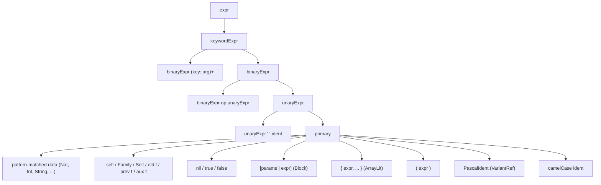
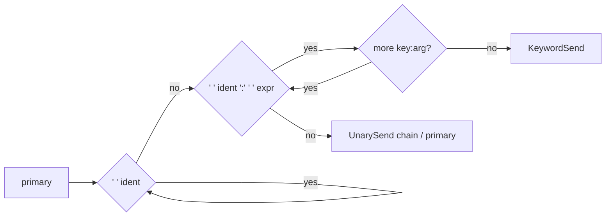
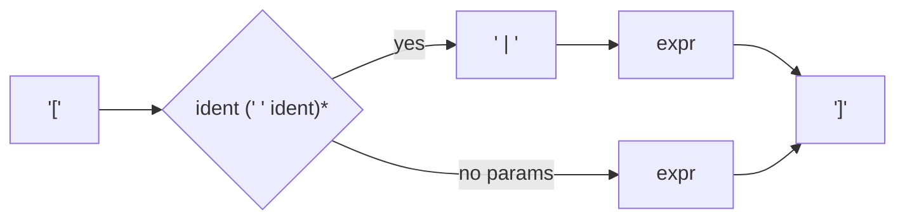
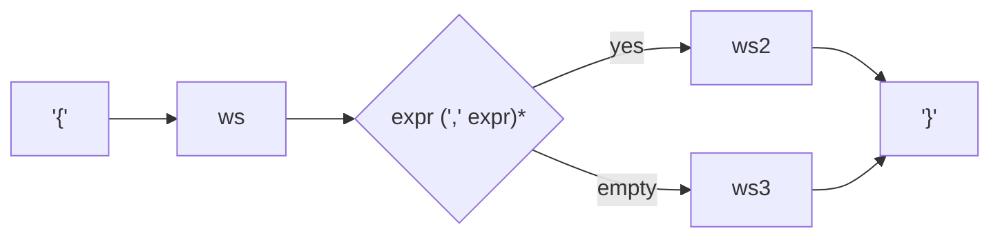
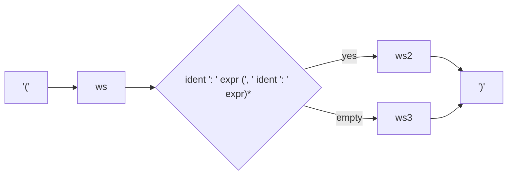
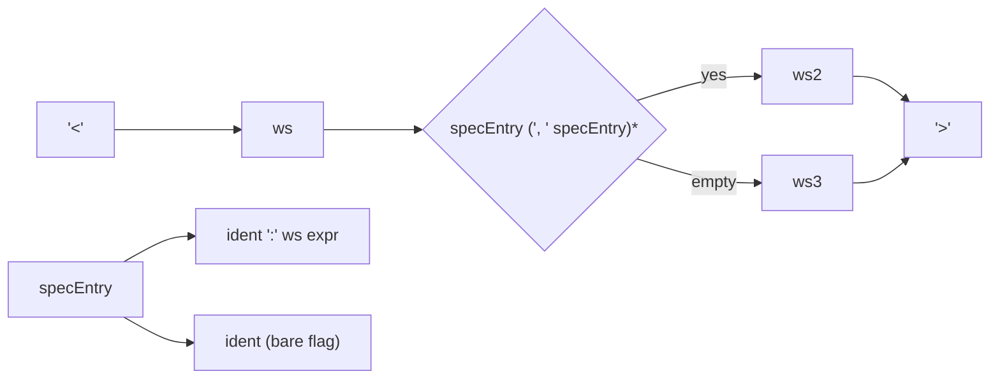

# Lapis Surface Syntax

> **Status:** Draft v0.1. This document specifies the surface syntax of Lapis: lexical structure,
> expression precedence, declaration forms, and the indentation strategy. Railroad diagrams are
> rendered as Mermaid flowcharts. The executable grammar lives in
> [`src/grammar.ts`](../../src/grammar.ts); this document is the human-readable specification that
> the grammar implements.

## 1. Lexical Structure

### 1.1 Character Classes

| Class   | Definition      | Used for         |
| ------- | --------------- | ---------------- |
| `digit` | `0-9`           | Numeric patterns |
| `alpha` | `a-z A-Z _`     | Identifier heads |
| `alnum` | `a-z A-Z 0-9 _` | Identifier tails |

### 1.2 Identifiers

Two classes, enforced by convention:

| Class                      | Pattern                                     | Used for                                            |
| -------------------------- | ------------------------------------------- | --------------------------------------------------- |
| `ident` (camelCase)        | `alpha` `alnum*` (head is lowercase or `_`) | Field names, operation names, spec keys, variables  |
| `pascalIdent` (PascalCase) | `A-Z` `alnum*` (head is uppercase)          | Variant names, type names, unfold constructor names |

Keywords are reserved and cannot be used as identifiers. The grammar checks word boundaries (next
char after keyword must not be `alnum` or `_`) to prevent `dataFoo` from matching `data`.

### 1.3 Pattern-Matched Data Types

Base types are eliminated (see [`design-decisions.md`](../design-decisions.md) §"No base types").
`Nat`, `Int`, `String`, `Bool`, etc. are `data` types with pattern-matched or named constructors.
The lexer is driven by `data` declarations: each pattern constructor is a lexical rule.

**Pattern language** (restricted regular fragment with type references):

| Construct         | Syntax               | Example             | Matches                                |
| ----------------- | -------------------- | ------------------- | -------------------------------------- |
| Character literal | any non-special char | `a`, `-`            | that character                         |
| Any character     | `.`                  | `.`                 | any single character                   |
| Character class   | `[...]`              | `[0-9]`, `[a-fA-F]` | one char in the set                    |
| Negated class     | `[^...]`             | `[^"]`              | one char NOT in the set                |
| One or more       | `+`                  | `[0-9]+`            | one or more of the preceding           |
| Zero or more      | `*`                  | `[^"]*`             | zero or more of the preceding          |
| Optional          | `?`                  | `-?`                | zero or one of the preceding           |
| Type reference    | `<TypeName>`         | `<Char>`, `<Nat>`   | match the pattern of another data type |
| Escape            | `\`                  | `\+`, `\.`, `\<`    | literal special char                   |

**Metacharacters** (must be escaped when meant literally): `+ * ? [ ] \ . < >`.

**Excluded:** alternation `|` (use multiple variants), groups `()`, anchors, backreferences. Flat
patterns compile to a DFA; type references (`<TypeName>`) make the pattern language context-free
(handled by the zipper-grammar engine's lazy `DelayedExp` recursion).

**Whitespace and patterns:** patterns match contiguous characters. A pattern may consume whitespace
if its structure includes it (via `.`, `[^...]`, classes containing space, or delimited regions like
`"..."`). Whitespace that no pattern consumes is a token boundary. Undelimited patterns (like
`[0-9]+`) naturally exclude space; delimited patterns (like `"<Char>*"`) naturally include it. This
is standard lexer behavior — no special rule needed.

**Anchoring:** patterns must start with a specific literal character or character class (not `.*` or
`*` or `?`). A pattern starting with `.` is allowed only if preceded by a literal delimiter (e.g.,
`".*"` is fine; bare `.*` is rejected). This prevents a pattern from matching everything from any
position.

**Disambiguation:** longest match wins; declaration order breaks ties. Named constructors take
precedence over patterns when both could match.

**Lexer priority:** patterns > operators > identifiers. Within each phase, longest match wins.

**Default (built-in) data types and their patterns:**

| Type     | Pattern(s)                 | Example         | Notes                                            |
| -------- | -------------------------- | --------------- | ------------------------------------------------ |
| `Char`   | `.`                        | `a`, `7`, `!`   | Any single character; the first data type        |
| `String` | `"<Char>*"`                | `"hello"`       | Double-quoted sequence of Chars (type reference) |
| `Nat`    | `[0-9]+`                   | `42`            | Natural numbers                                  |
| `Int`    | `-[0-9]+` and `[0-9]+`     | `-3`, `42`      | Negative and non-negative                        |
| `Bool`   | `True` and `False` (named) | `true`, `false` | Named constructors, not patterns                 |
| `Symbol` | `#[a-zA-Z][a-zA-Z0-9]*`    | `#sum`          | Used in merge references                         |

User-defined types (e.g., `Complex`, `Rational`) declare their own patterns.

### 1.4 Comments

Comments are `"..."` (double-quoted strings that are consumed and discarded). This is the Smalltalk
convention. No nesting in v0.

```lapis
Color Red toHex                     "=> '#FF0000'"
```

### 1.5 Keywords

| Keyword     | Purpose                                |
| ----------- | -------------------------------------- |
| `data`      | Data type declaration (μ-type)         |
| `behavior`  | Behavior type declaration (ν-type)     |
| `protocol`  | Protocol declaration (qualified type)  |
| `relation`  | Relation declaration (data + span)     |
| `query`     | Query declaration (behavior + cospan)  |
| `io`        | IO declaration (Mealy machine)         |
| `fold`      | Fold operation (catamorphism)          |
| `unfold`    | Unfold operation (anamorphism)         |
| `map`       | Map operation (field transformation)   |
| `merge`     | Merge operation (deforestation)        |
| `satisfies` | Protocol conformance clause            |
| `not`       | Boolean negation (prefix)              |
| `self`      | Current instance (always in scope)     |
| `Family`    | Recursive self-reference in data       |
| `Self`      | Corecursive self-reference in behavior |
| `old`       | Raw pre-fold sub-node (paramorphism)   |
| `prev`      | Previous fold result (histomorphism)   |
| `aux`       | Auxiliary fold result (zygomorphism)   |

### 1.6 Special Values

| Token   | Meaning               |
| ------- | --------------------- |
| `nil`   | Null reference        |
| `true`  | Boolean True variant  |
| `false` | Boolean False variant |

## 2. Expression Precedence

Expressions follow the Smalltalk message-send model with three precedence levels between message
_types_ (unary > binary > keyword) and **uniform precedence within binary messages** (all binary
operators have the same precedence, evaluated left-to-right).

### 2.1 Precedence Table

| Level       | Production    | Message type                                    | Associativity      | AST Node      |
| ----------- | ------------- | ----------------------------------------------- | ------------------ | ------------- |
| 1 (lowest)  | `keywordExpr` | Keyword messages                                | Left               | `KeywordSend` |
| 2           | `binaryExpr`  | Binary messages (all symbolic operators)        | **Left (uniform)** | `BinarySend`  |
| 3 (highest) | `unaryExpr`   | Unary messages                                  | Left               | `UnarySend`   |
| —           | `primary`     | literals, refs, blocks, arrays, records, parens | —                  | various       |

**Uniform binary precedence:** ALL binary operators (`+`, `-`, `*`, `/`, `<`, `<=`, `=`, `,`, `&`,
`|`, etc.) have the same precedence. `1 + 2 * 3` parses as `(1 + 2) * 3 = 9`. Explicit parentheses
are required for mathematical grouping: `1 + (2 * 3) = 7`. This follows the Smalltalk model: binary
messages are simply message sends, and the language does not assign one higher priority than
another. See [`design-decisions.md`](../design-decisions.md) §"Symbolic operation names".

**Symbolic operation names:** Binary operators are fold names. They can be symbolic (`+`, `*`, `<`,
`<=`, `<+>`, `<>`) or named (`add`, `mul`, `lessThan`). Symbolic operators are recognized by longest
match among declared operators. Multi-character operators (`<=`, `==`, `<>`, `<+>`) are supported.
Operation names are contiguous non-whitespace sequences; they can include grouping characters (`<`,
`>`, `(`, `)`, `[`, `]`, `{`, `}`). They can never be patterns — they're in a different lexical
context (expression level, not pattern level).

**Position discriminates data from operations:** Symbolic characters in prefix position (start of
token) are pattern-matched constructors (data introduction). Symbolic characters in infix position
(between whitespace-delimited tokens) are symbolic operations (folds/elimination). The lexer
alternates between "expecting a token" (prefix — try patterns > identifiers > named constructors)
and "expecting an operator" (infix — try operators > identifiers for named sends).

### 2.2 Railroad Diagram: Expression Hierarchy



**Note:** The `binaryExpr` production is a single level — all binary operators parse at the same
precedence, left-associative. The previous 6-level ladder (`orExpr` through `consExpr`) is collapsed
into one level.

### 2.3 Message Sends (Smalltalk Model)

Lapis uses Smalltalk-style message sends with three precedence levels:

**Unary messages** (tightest bind, no arguments):

```lapis
Color Red toHex
instance size
nats head
```

Parses as: `((Color Red) toHex)` — left-to-right chain of unary sends.

**Binary messages** (uniform precedence, left-to-right):

```lapis
a + b * c          "parses as (a + b) * c — uniform precedence"
a + (b * c)        "explicit grouping required for mathematical precedence"
3+4j < 1+6j        "Complex pattern tokens, then binary < "
```

All binary operators (`+`, `-`, `*`, `/`, `<`, `<=`, `=`, `,`, etc.) have the same precedence. There
is no operator hierarchy. Binary operators are fold names — symbolic (`+`, `*`) or named (`add`,
`mul`) — recognized by longest match among declared operators.

**Keyword messages** (lowest precedence, multi-argument, collected greedily):

```lapis
nats take: 5
a between:and: lo hi
stack append: 3
```

A keyword send is `receiver key1: arg1 key2: arg2 ...`. The selector is the concatenation of the
keyword parts: `take:`, `between:and:`, `append:`.

**Message chain rule** (from `src/grammar.ts`):

```
messageChain = primary (unarySuffix* keywordSuffix?)?
unarySuffix  = ' ' ident
keywordSuffix = (' ' ident ':' ' ' expr)+
```

A primary followed by zero or more unary suffixes, optionally followed by a keyword suffix. If
keyword suffixes are present, they collect all `key: arg` pairs greedily into a single
`KeywordSend`.

### 2.4 Railroad Diagram: Message Chain



## 3. Composite Expressions

### 3.1 Block Literal `[params | expr]`

A first-class block (lambda). Two forms:

```lapis
[expr]                    — no parameters
[x y | expr]              — one or more parameters
```



**AST:** `Block(params: Ident[], body: Node)`

Blocks are used for: callbacks, guards, contract clauses, map transforms, and case-arm bodies (when
multi-line).

### 3.2 Array Literal `{ expr, expr, ... }`

```lapis
{}                        — empty array
{1, 2, 3}                 — three elements
{value} , rest            — cons (via ',' operator at level 6)
```



**AST:** `ArrayLit(items: Node[])`

### 3.3 Record `(key: val, ...)`

Inline record / named-argument record. Used for specs, named-argument construction, and Mealy
machine state transitions.

```lapis
(x: 3, y: 4)
(commutative, associative, identity: (Num N: 0))
```



**AST:** `Record(entries: RecordEntry[])` where `RecordEntry(key: string, value: Node)`

### 3.4 Spec Record `<key: val, key, ...>`

The spec record appears after a fold/unfold/map name. Entries are either `key: value` or bare flags
(boolean presence).

```lapis
<out: Number>
<in: target Object, out: Boolean>
<para>
<histo, out: Number>
<aux: #length, out: Number>
<out: Family, properties: (distributive: #sum)>
```



**AST:** `Spec(entries: SpecEntry[])` where `SpecEntry(key: string, value: Node | null)`

**Recognized spec keys:**

| Key          | Value                       | Meaning                                |
| ------------ | --------------------------- | -------------------------------------- |
| `in`         | `paramName Type` or `Type`  | Input parameter with type              |
| `out`        | `Type`                      | Output/return type                     |
| `para`       | (flag)                      | Paramorphism — `old field` available   |
| `histo`      | (flag)                      | Histomorphism — `prev field` available |
| `aux`        | `#foldName` or `(#f1, #f2)` | Zygomorphism — auxiliary fold result   |
| `typeParam`  | `Type`                      | Type parameter for map                 |
| `properties` | `(prop1, prop2, ...)`       | Algebraic property annotations         |

## 4. Declaration Forms

### 4.1 `data` — Algebraic Data Type (μ-type)

```lapis
data TypeName [<: Parent]
    Variant1 field1: Type1 field2: Type2
    Variant2
    ...
    fold opName <spec>
        Pattern bindings -> body
        ...
    unfold ConstructorName <spec>
        Pattern bindings -> body
        ...
    map opName <spec> [params | expr]
    merge opName <#op1, #op2>
    satisfies: ProtocolName
```

```mermaid
flowchart TD
    kw["'data '"] --> name["PascalIdent"]
    name --> parent{"' <: ' PascalIdent?"}
    parent --> nl["newline"]
    nl --> body["indented body lines"]
    body --> bodyItem["variant / fold / unfold / map / merge / satisfies"]
    bodyItem --> more{"newline + body line?"}
    more -->|yes| bodyItem
    more -->|no> done["DataDecl"]
```

**Body items** (each indented by 4 spaces under the `data` header):

| Item      | Starts with                | Grammar production |
| --------- | -------------------------- | ------------------ |
| Variant   | PascalCase identifier      | `variantDecl`      |
| Fold      | `fold` + camelCase name    | `foldDecl`         |
| Unfold    | `unfold` + PascalCase name | `unfoldDecl`       |
| Map       | `map` + camelCase name     | `mapDecl`          |
| Merge     | `merge` + camelCase name   | `mergeDecl`        |
| Satisfies | `satisfies:` + PascalCase  | `satisfiesClause`  |

**AST:** `DataDecl(name, parent, body: DataBodyItem[])`

### 4.2 `behavior` — Final Coalgebra (ν-type)

```lapis
behavior TypeName [<: Parent]
    observer1: <out: Type>
    observer2: <in: ParamType, out: Type>
    ...
    fold opName <spec>
        _ observations -> body
    unfold ConstructorName <spec>
        observer -> generator
    map opName <spec> [params | expr]
    merge opName <#op1, #op2>
```

Observers are declared as `name: <spec>` (a field with a spec record as its type). The `Self`
keyword in an observer's spec declares a continuation (lazy self-reference).

**AST:** `BehaviorDecl(name, parent, observers: Field[], body: BehaviorBodyItem[])`

### 4.3 `protocol` — Qualified Type

```lapis
protocol ProtocolName [<: Parent]
    fold opName <spec>
    fold opName <spec>
        _ default body
```

Protocol methods are fold declarations. A method with an indented body below provides a default
implementation; one without is abstract (required).

**AST:** `ProtocolDecl(name, parent, methods: FoldDecl[])`

### 4.4 `relation` — Span-Structured Data

```lapis
relation RelationName
    Variant1 from: Type to: Type
    Variant2 hop: Family rest: Family
    fold origin <out: Type>
        ...
    fold destination <out: Type>
        ...
```

A relation is a `data` type with two required fold operations (`origin` and `destination`) that
project each variant to its endpoints. The join invariant for recursive variants is auto-generated.

**AST:** `RelationDecl(name, variants: Variant[], folds: FoldDecl[])`

### 4.5 `query` — Cospan-Structured Behavior

```lapis
query QueryName
    observer1: Type
    observer2: Type
    ...
    unfold ConstructorName <spec>
        observer -> generator
```

A query is a `behavior` type with cospan projections (`output`, `done`, `accept`) that name the
observer fields serving each coalgebraic role. The `explore()` operation is auto-generated.

**AST:** `QueryDecl(name, observers: Field[], unfolds: UnfoldDecl[])`

### 4.6 `io` — Mealy Machine

```lapis
io MachineName
    stateField1: Type
    stateField2: Type
    ...
    StepName binding -> (state: newState, output: value)
    ...
```

IO programs are Mealy machines: state fields + PascalCase step handlers. Each step handler binds the
current state and returns a record with the next state and output.

**AST:** `IoDecl(name, stateFields: Field[], arms: CaseArm[])`

## 5. Fold/Unfold/Map/Merge Declarations

### 5.1 Fold Declaration

```lapis
fold opName <spec>
    [contractClause]
    [contractClause]
    Pattern bindings -> body
    Pattern bindings -> body
    ...
```

Contract clauses (`invariant:`, `demands:`, `ensures:`, `rescue:`) appear before case arms, one per
line. Each case arm is `VariantName binding1 binding2 -> body` where bindings are field names
(camelCase) or `_` (wildcard). The body is either inline (same line after `->`) or indented on the
next line.

```mermaid
flowchart TD
    kw["'fold '"] --> name["camelCase ident"]
    name --> spec["<spec>?"]
    spec --> nl["newline"]
    nl --> line["indented line"]
    line --> contract{"contractClause?"}
    contract -->|yes| cline["invariant/demands/ensures/rescue: [block]"]
    cline --> more{"newline + line?"}
    contract -->|no> arm["caseArm"]
    arm --> more
    more -->|yes| line
    more -->|no> done["FoldDecl"]
```

**Case arm:**

```mermaid
flowchart TD
    pat["PascalIdent"] --> bind{"' ' binding (' ' binding)*?"}
    bind -->|yes| binds["ident or '_'"]
    binds --> arrow1["' -> '"]
    bind -->|no> arrow2["' ->'"]
    arrow1 --> inline["expr (same line)"]
    arrow2 --> nl["newline + deeper indent"]
    nl --> block["expr (indented)"]
```

**AST:** `FoldDecl(name, spec, contractClauses, arms: CaseArm[])`

### 5.2 Unfold Declaration

Same structure as fold, but:

- Name is PascalCase (constructor name)
- No contract clauses (v0 — contracts on unfolds are checked at observation time)
- Arms are generators: `observer -> generatorExpr`

**AST:** `UnfoldDecl(name, spec, arms: CaseArm[])`

### 5.3 Map Declaration

```lapis
map opName <spec> [params | expr]
```

A single-line declaration: the transform is a block literal.

**AST:** `MapDecl(name, spec, transform: Block)`

### 5.4 Merge Declaration

```lapis
merge opName <#op1, #op2, ...>
```

Composes named operations into a single fused operation. The references are symbol literals
(`#name`).

**AST:** `MergeDecl(name, foldNames: string[])`

## 6. Indentation Strategy

### 6.1 Fixed 4-Space Indent Unit

Lapis uses significant indentation with a fixed 4-space indent unit. This replaces explicit
delimiters (`{...}`, `begin...end`) for declaration bodies and case tables.

### 6.2 Column-Parameterised Productions

The grammar (in `src/grammar.ts`) implements indentation via **P4P-style column-parameterised
productions** — no pre-pass, no token rewriting. Every block-introducing production is a `@rule`
method accepting `col: number` (the child column):

```typescript
@rule foldDecl(col: number): Parser<S['foldDecl']> {
    const childCol = col + INDENT;  // INDENT = 4
    const armLine = this.seq(this.spaces(childCol), this.caseArm(childCol))
        .map(([, a]) => a as CaseArm);
    // ...
}
```

`spaces(n)` matches exactly `n` space characters via recursion, cached per `n` by the `@rule`
decorator. This means:

- `spaces(4)` matches exactly 4 spaces
- `spaces(8)` matches exactly 8 spaces
- Each is a separate memoised parser node

### 6.3 Indentation Levels

| Context                         | Column | Example            |
| ------------------------------- | ------ | ------------------ |
| Top-level declaration           | 0      | `data Color`       |
| Body of a declaration           | 4      | `Red Green Blue`   |
| Case arms / contracts in a fold | 8      | `Red -> '#FF0000'` |
| Multi-line case arm body        | 12     | `expr`             |

### 6.4 Newline as Statement Separator

Newlines separate statements and body lines. The grammar matches `\r\n` or `\n`. Blank lines and
comments are consumed between body lines.

### 6.5 Inline vs Indented Bodies

Case arms support two body forms:

**Inline** (single expression on same line):

```lapis
Red -> '#FF0000'
```

**Indented** (expression on next line, deeper indent):

```lapis
Point2D x y ->
    (x squared + y squared) sqrt
```

The grammar tries the indented form first (longer match), then falls back to inline.

## 7. Special References in Expressions

| Reference    | Syntax         | Meaning                                | AST Node    |
| ------------ | -------------- | -------------------------------------- | ----------- |
| `self`       | `self`         | Current instance (always in scope)     | `SelfRef`   |
| `Family`     | `Family`       | Recursive self-reference in data       | `FamilyRef` |
| `Self`       | `Self`         | Corecursive self-reference in behavior | `CoSelfRef` |
| `old field`  | `old` + ident  | Raw pre-fold sub-node (paramorphism)   | `OldRef`    |
| `prev field` | `prev` + ident | Previous fold result (histomorphism)   | `PrevRef`   |
| `aux fold`   | `aux` + ident  | Auxiliary fold result (zygomorphism)   | `AuxRef`    |

These are parsed in the `primary` production, before regular identifiers, so `old`, `prev`, `aux`,
`self`, `Family`, and `Self` are reserved as keyword-like references.

## 8. Complete Example

```lapis
data Stack
    Empty
    Push value: Any rest: Family

    fold size <out: Number>
        Empty -> 0
        Push _ rest -> 1 + rest

    fold peek
        Empty -> nil
        Push value -> value

    fold pop <para>
        Empty -> nil
        Push value rest -> value , old rest

    unfold FromArray <in: arr Array>
        Empty -> arr isEmpty
        Push -> arr notEmpty | (value: arr first, rest: arr tail)

s = Stack Push value: 3 rest: (Stack Push value: 2 rest: Stack Empty)
s size            "=> 2"
s peek            "=> 3"
s pop             "=> [3, Push(value:2, rest:Empty)]"
```

## 9. Open Questions

1. **String escapes.** Strings are now pattern-matched data types (`String = μ α. "<Char>*"`).
   Escape sequences (`\n`, `\t`, `\"`, `\\`) would need to be handled in the `Char` pattern or in a
   separate escape sub-pattern. Need to decide: add escapes at the `Char` level, or handle them in
   the fold handler that processes the matched token.

2. **Negative integer literals.** `-42` is now a pattern-matched constructor of
   `Int = μ α. (-[0-9]+ | [0-9]+)`. The pattern `-[0-9]+` matches the negative form directly. This
   resolves the old question: `-42` is a literal, not a prefix send. However, `a - b` (subtraction)
   and `-42` (negative literal) must be disambiguated by context (infix vs prefix position). The
   lexer's prefix/infix alternation handles this.

3. **Uniform binary precedence and `,` (cons).** With uniform binary precedence, `a + b , c` parses
   as `(a + b) , c` (left-to-right). This is the same as every other binary operator. The question
   of whether `,` should have different precedence is moot under the Smalltalk model — it doesn't.
   Users must use parentheses if they want different grouping.

4. **Keyword send ambiguity with specs.** A spec record `<out: Number>` uses `:` inside angle
   brackets, while a keyword send `take: 5` uses `:` in message position. The grammar disambiguates
   by context (specs only appear after fold/unfold/map names), but this is fragile. Consider whether
   a different spec syntax would be cleaner.

5. **Multi-line expressions.** The current grammar requires expressions to be on a single line (or
   an indented continuation for case-arm bodies). No explicit line-continuation syntax. Long
   expressions must be broken into `let` bindings or blocks. Is this sufficient, or do we need a
   continuation operator?

6. **Nested blocks and indentation.** A block `[params | expr]` contains an expression, which could
   be a multi-line indented body. How does block-internal indentation interact with the surrounding
   indentation context? The grammar currently treats the block body as a single `expr` production,
   which doesn't handle multi-line block bodies. This needs resolution.

7. **Pattern constructors with captures (tentative).** Should pattern constructors support named
   captures (`<name: TypeName>`) that extract sub-matches as typed fields? E.g.,
   `Rect <real: Nat>\+<imag: Nat>j` for `Complex`, where `real` and `imag` are bound in fold
   handlers. Conceptually sound (pattern = parser, captures = semantic values) but syntax and
   handler-dispatch mechanics need validation against a real implementation. Deferred until Stage 1.
